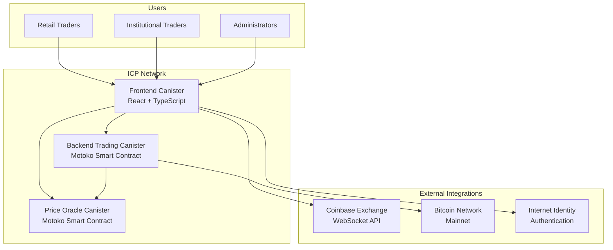
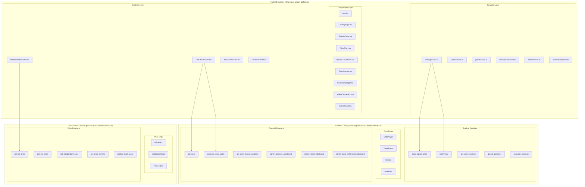
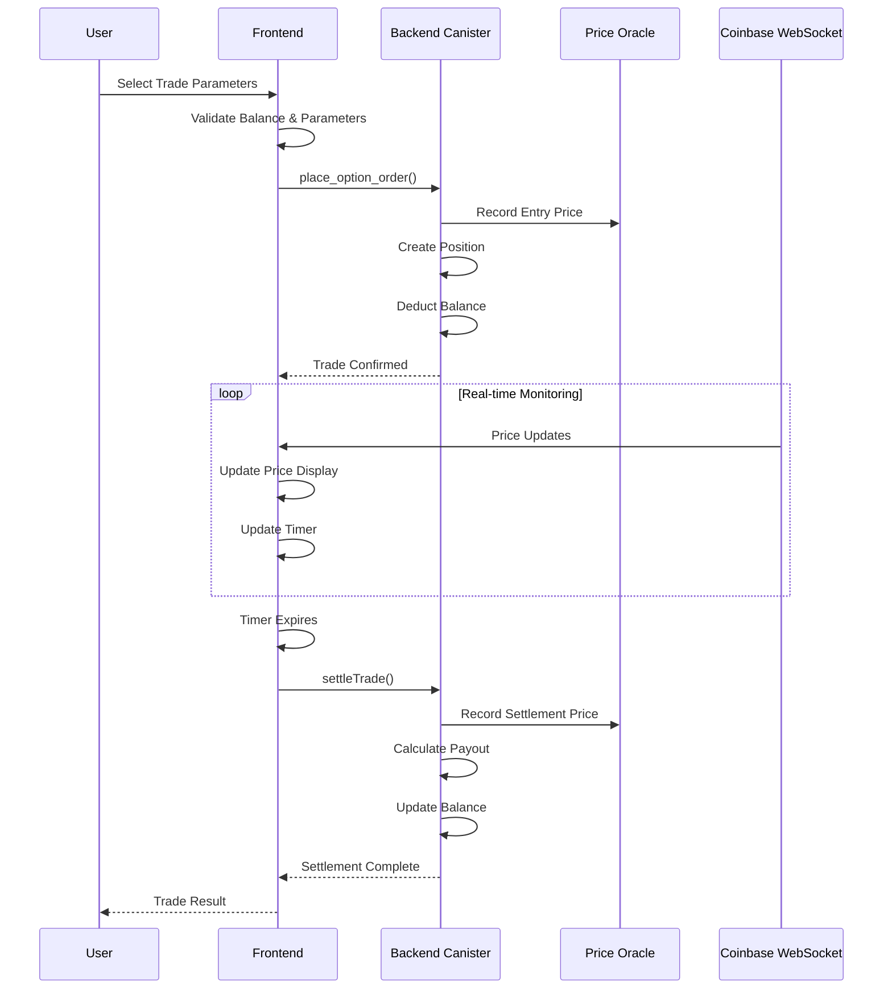
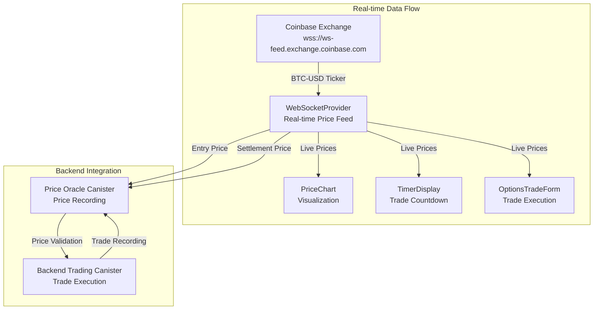
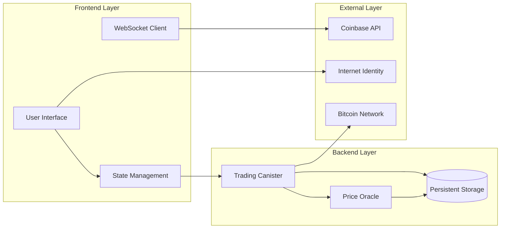
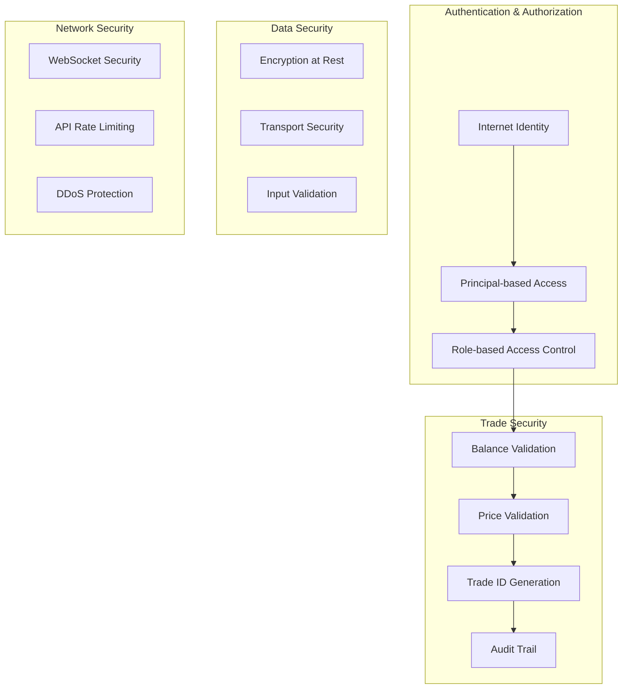
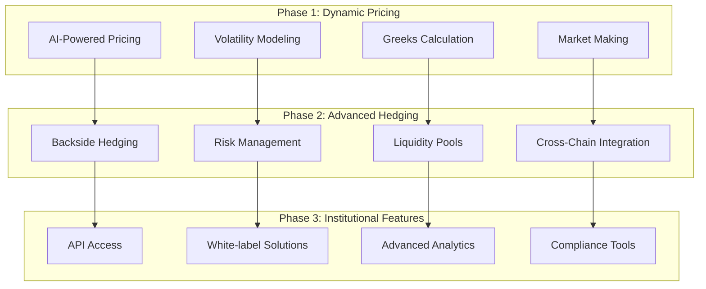
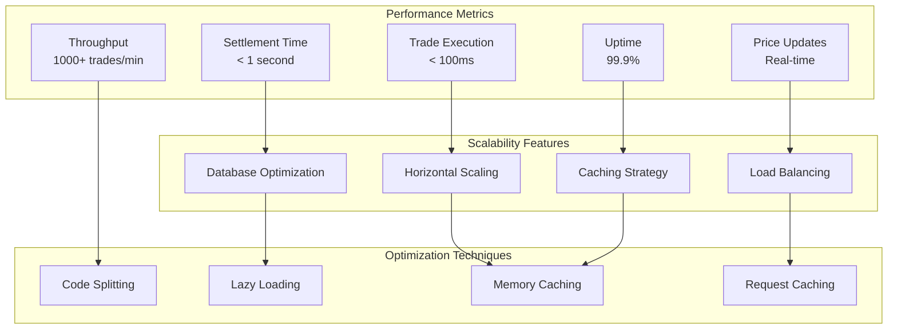
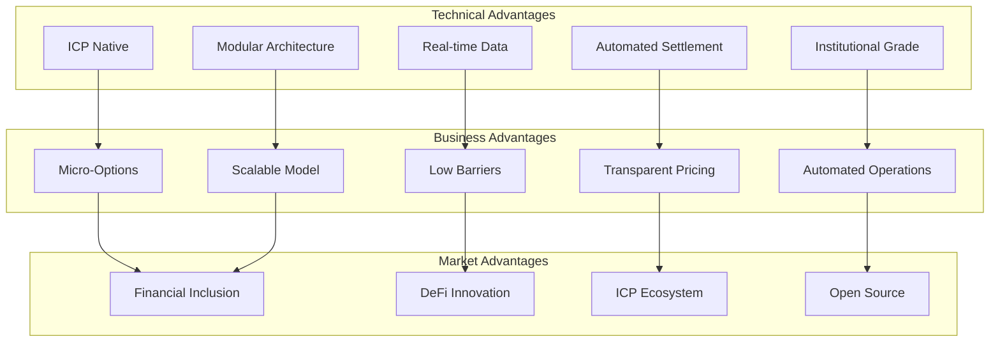
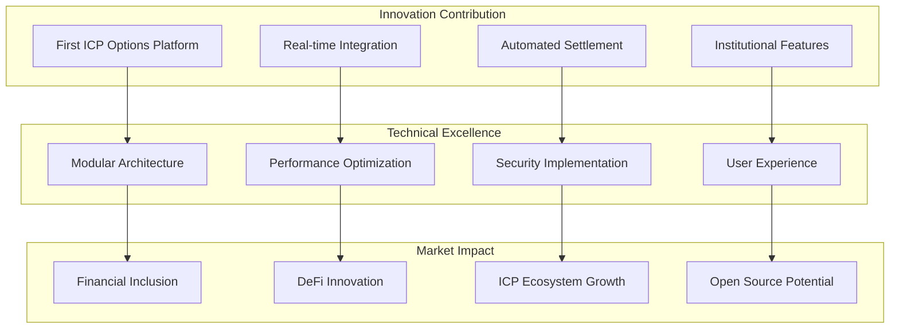

# 🏗️ Mermaid Architecture Diagrams

## System Overview

## Canister Architecture

## Trade Execution Flow

## Price Feed Architecture

## Data Flow Architecture

## Security Architecture

## Future Enhancement Architecture

## Performance Architecture

## Competitive Advantages

## ICP Grant Proposal Value

